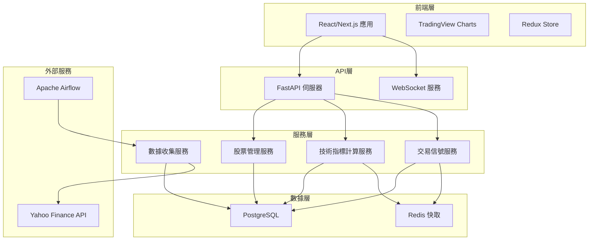

# 設計文檔

## 概述

股票數據收集與技術分析平台採用現代化的微服務架構，結合Python後端生態系統和React前端技術棧。系統設計重點在於高效的數據處理、即時的技術指標計算，以及流暢的用戶體驗。

## 架構

### 系統架構圖



### 技術棧

**後端技術棧：**
- Python 3.10+
- FastAPI (REST API 框架)
- Apache Airflow (工作流程自動化)
- PostgreSQL (主資料庫)
- Redis (快取和會話管理)
- Docker & Docker Compose (容器化部署)

**前端技術棧：**
- React 18 / Next.js 14
- TypeScript
- TailwindCSS (樣式框架)
- TradingView Lightweight Charts (專業圖表庫)
- Redux Toolkit (狀態管理)
- React Query (資料獲取和快取)

**數據處理技術棧：**
- yfinance (Yahoo Finance API 客戶端)
- pandas (數據處理和分析)
- TA-Lib (技術指標計算庫)
- NumPy (數值運算)

## 組件和介面

### 後端組件

#### 1. 股票管理服務 (StockManagementService)
```python
class StockManagementService:
    async def add_stock(self, symbol: str, market: str) -> Stock
    async def remove_stock(self, stock_id: int) -> bool
    async def get_user_stocks(self, user_id: int) -> List[Stock]
    async def batch_add_stocks(self, symbols: List[str]) -> BatchResult
    async def validate_symbol(self, symbol: str, market: str) -> bool
```

#### 2. 數據收集服務 (DataCollectionService)
```python
class DataCollectionService:
    async def fetch_daily_data(self, symbol: str) -> StockData
    async def backfill_historical_data(self, symbol: str, start_date: date) -> List[StockData]
    async def validate_data_integrity(self, symbol: str) -> ValidationResult
    async def schedule_data_collection(self) -> None
```

#### 3. 技術指標計算服務 (TechnicalIndicatorService)
```python
class TechnicalIndicatorService:
    async def calculate_rsi(self, prices: List[float], period: int = 14) -> List[float]
    async def calculate_sma(self, prices: List[float], period: int) -> List[float]
    async def calculate_ema(self, prices: List[float], period: int) -> List[float]
    async def calculate_macd(self, prices: List[float]) -> MACDResult
    async def calculate_bollinger_bands(self, prices: List[float]) -> BollingerBands
    async def calculate_kd(self, high: List[float], low: List[float], close: List[float]) -> KDResult
```

#### 4. 交易信號服務 (TradingSignalService)
```python
class TradingSignalService:
    async def detect_golden_cross(self, short_ma: List[float], long_ma: List[float]) -> List[Signal]
    async def detect_death_cross(self, short_ma: List[float], long_ma: List[float]) -> List[Signal]
    async def generate_buy_sell_signals(self, stock_data: StockData) -> List[TradingSignal]
    async def get_signal_history(self, symbol: str) -> List[TradingSignal]
```

### 前端組件

#### 1. 股票管理組件
```typescript
interface StockManagementProps {
  onStockAdded: (stock: Stock) => void;
  onStockRemoved: (stockId: number) => void;
}

const StockManagement: React.FC<StockManagementProps>
```

#### 2. 圖表顯示組件
```typescript
interface ChartDisplayProps {
  stockData: StockData[];
  indicators: TechnicalIndicators;
  signals: TradingSignal[];
  timeRange: TimeRange;
}

const ChartDisplay: React.FC<ChartDisplayProps>
```

#### 3. 技術指標面板
```typescript
interface IndicatorPanelProps {
  indicators: TechnicalIndicators;
  onIndicatorToggle: (indicator: string) => void;
}

const IndicatorPanel: React.FC<IndicatorPanelProps>
```

### API 端點設計

```python
# 股票管理 API
POST /api/stocks - 新增股票
DELETE /api/stocks/{stock_id} - 刪除股票
GET /api/stocks - 獲取用戶股票清單
POST /api/stocks/batch - 批次新增股票

# 數據 API
GET /api/stocks/{symbol}/data - 獲取股票數據
POST /api/stocks/{symbol}/refresh - 手動更新數據
GET /api/stocks/{symbol}/indicators - 獲取技術指標

# 交易信號 API
GET /api/stocks/{symbol}/signals - 獲取交易信號
GET /api/signals/history - 獲取信號歷史

# WebSocket 端點
WS /ws/stocks/{symbol} - 即時數據推送
```

## 數據模型

### 核心數據模型

```python
class Stock(BaseModel):
    id: int
    symbol: str
    market: str  # 'TW' or 'US'
    name: str
    created_at: datetime
    updated_at: datetime

class StockData(BaseModel):
    id: int
    stock_id: int
    date: date
    open_price: Decimal
    high_price: Decimal
    low_price: Decimal
    close_price: Decimal
    volume: int
    adjusted_close: Decimal

class TechnicalIndicator(BaseModel):
    id: int
    stock_id: int
    date: date
    indicator_type: str
    value: Decimal
    parameters: Dict[str, Any]

class TradingSignal(BaseModel):
    id: int
    stock_id: int
    signal_type: str  # 'golden_cross', 'death_cross', 'buy', 'sell'
    date: date
    price: Decimal
    confidence: float
    description: str
```

### 資料庫設計

```sql
-- 股票基本資料表
CREATE TABLE stocks (
    id SERIAL PRIMARY KEY,
    symbol VARCHAR(20) NOT NULL,
    market VARCHAR(5) NOT NULL,
    name VARCHAR(100),
    created_at TIMESTAMP DEFAULT CURRENT_TIMESTAMP,
    updated_at TIMESTAMP DEFAULT CURRENT_TIMESTAMP,
    UNIQUE(symbol, market)
);

-- 股票數據表
CREATE TABLE stock_data (
    id SERIAL PRIMARY KEY,
    stock_id INTEGER REFERENCES stocks(id),
    date DATE NOT NULL,
    open_price DECIMAL(10,4),
    high_price DECIMAL(10,4),
    low_price DECIMAL(10,4),
    close_price DECIMAL(10,4),
    volume BIGINT,
    adjusted_close DECIMAL(10,4),
    UNIQUE(stock_id, date)
);

-- 技術指標表
CREATE TABLE technical_indicators (
    id SERIAL PRIMARY KEY,
    stock_id INTEGER REFERENCES stocks(id),
    date DATE NOT NULL,
    indicator_type VARCHAR(20) NOT NULL,
    value DECIMAL(15,8),
    parameters JSONB,
    INDEX(stock_id, date, indicator_type)
);

-- 交易信號表
CREATE TABLE trading_signals (
    id SERIAL PRIMARY KEY,
    stock_id INTEGER REFERENCES stocks(id),
    signal_type VARCHAR(20) NOT NULL,
    date DATE NOT NULL,
    price DECIMAL(10,4),
    confidence DECIMAL(3,2),
    description TEXT,
    INDEX(stock_id, date)
);
```

## 錯誤處理

### 錯誤分類和處理策略

1. **數據收集錯誤**
   - API 限制錯誤：實施指數退避重試機制
   - 網路連接錯誤：自動重試最多3次
   - 數據格式錯誤：記錄錯誤並跳過該筆數據

2. **計算錯誤**
   - 數據不足錯誤：返回適當的錯誤訊息
   - 數值溢出錯誤：使用安全的數值計算方法
   - 參數錯誤：驗證輸入參數並返回詳細錯誤訊息

3. **系統錯誤**
   - 資料庫連接錯誤：實施連接池和自動重連
   - 快取錯誤：降級到直接資料庫查詢
   - 服務不可用：返回適當的HTTP狀態碼和錯誤訊息

### 錯誤處理實現

```python
class StockAnalysisException(Exception):
    """基礎異常類別"""
    pass

class DataCollectionError(StockAnalysisException):
    """數據收集相關錯誤"""
    pass

class CalculationError(StockAnalysisException):
    """計算相關錯誤"""
    pass

@app.exception_handler(StockAnalysisException)
async def stock_analysis_exception_handler(request: Request, exc: StockAnalysisException):
    return JSONResponse(
        status_code=400,
        content={"error": str(exc), "type": exc.__class__.__name__}
    )
```

## 測試策略

### 測試層級

1. **單元測試**
   - 技術指標計算函數測試
   - 數據驗證邏輯測試
   - 交易信號偵測邏輯測試
   - 覆蓋率目標：90%以上

2. **整合測試**
   - API 端點測試
   - 資料庫操作測試
   - 外部API整合測試
   - WebSocket 連接測試

3. **端到端測試**
   - 完整的數據收集流程測試
   - 用戶操作流程測試
   - 圖表渲染和互動測試

### 測試工具和框架

```python
# 後端測試
pytest                    # 測試框架
pytest-asyncio           # 異步測試支援
pytest-cov              # 覆蓋率報告
httpx                   # HTTP 客戶端測試
pytest-mock             # Mock 支援

# 前端測試
Jest                    # JavaScript 測試框架
React Testing Library   # React 組件測試
Cypress                # 端到端測試
```

### 效能考量

1. **數據快取策略**
   - Redis 快取熱門股票的技術指標
   - 快取過期時間：技術指標30分鐘，股票數據1小時

2. **資料庫優化**
   - 為常用查詢建立複合索引
   - 實施數據分區（按日期分區）
   - 使用連接池管理資料庫連接

3. **前端效能**
   - 圖表數據虛擬化（大數據集）
   - 組件懶加載
   - API 響應快取（React Query）

4. **系統監控**
   - 應用效能監控（APM）
   - 資料庫查詢效能監控
   - API 響應時間監控