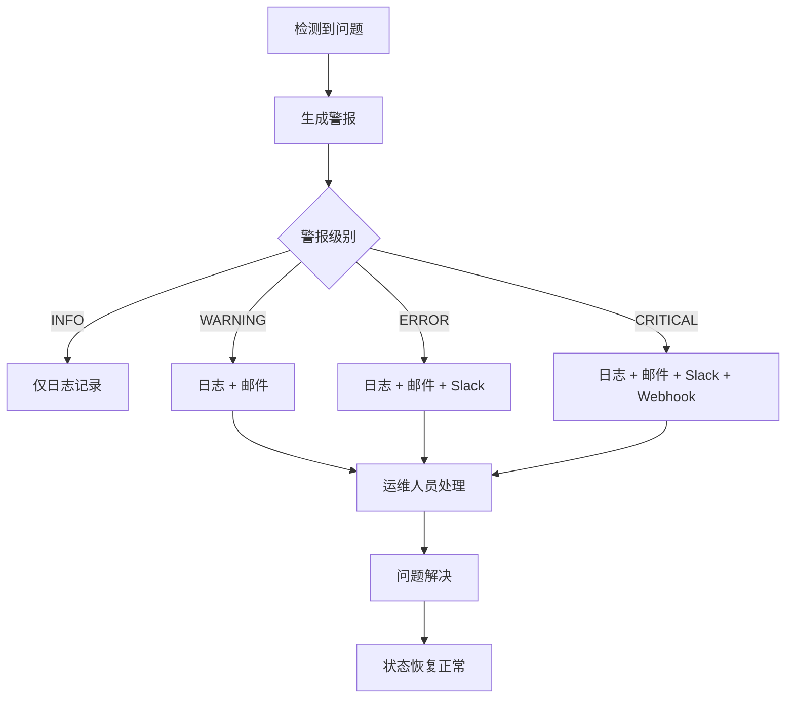

# 外部存储监控和警示系统

## 📋 概述

本文档描述了针对 XCom 外部存储系统的增强监控和警示解决方案，解决原有的 48KB 限制问题，并提供全面的运维监控能力。

## 🎯 解决的问题

### 原有问题
1. **XCom 48KB 限制** - Airflow XCom 数据大小限制导致大数据传输失败
2. **Redis 故障无感知** - Redis 存储失败时只有日志记录，缺乏及时通知
3. **缺乏监控指标** - 无法了解存储使用情况和性能状况
4. **维护工具缺失** - 缺乏自动化清理和维护机制

### 解决方案
1. **增强的外部存储管理器** - 支持 Redis 健康检查、性能监控、自动重连
2. **多渠道通知系统** - 邮件、Slack、Webhook 等多种通知方式
3. **存储监控仪表板** - 实时健康状态、性能指标、趋势分析
4. **自动化维护流程** - 定期清理、健康检查、容量监控

## 🏗️ 系统架构

```
┌─────────────────┐    ┌──────────────────┐    ┌─────────────────┐
│   API Operator  │───▶│  Storage Manager │───▶│   Redis Store   │
└─────────────────┘    └──────────────────┘    └─────────────────┘
         │                       │                       │
         ▼                       ▼                       ▼
┌─────────────────┐    ┌──────────────────┐    ┌─────────────────┐
│ Notification    │    │ Performance      │    │ Health Monitor  │
│ Manager         │    │ Metrics          │    │ & Auto-Recovery │
└─────────────────┘    └──────────────────┘    └─────────────────┘
         │                       │                       │
         ▼                       ▼                       ▼
┌─────────────────┐    ┌──────────────────┐    ┌─────────────────┐
│ Multi-Channel   │    │ Storage          │    │ Monitoring      │
│ Alerts          │    │ Dashboard        │    │ DAG             │
└─────────────────┘    └──────────────────┘    └─────────────────┘
```

## 🔧 核心组件

### 1. 增强的存储管理器 (`xcom_storage.py`)

#### 主要功能：
- **健康检查机制** - 定期检查 Redis 连接状态和性能
- **自动重连逻辑** - 连续失败时自动尝试重新连接
- **性能监控** - 记录操作时间、成功率、数据大小等指标
- **故障处理** - 智能降级和错误恢复

#### 关键特性：
```python
# 健康检查
health_data = storage_manager.check_redis_health()

# 性能监控
with storage_manager._performance_monitor('store', ref_id):
    # 存储操作

# 指标收集
metrics = storage_manager.get_metrics_summary(days=7)
```

### 2. 通知管理器 (`notification_manager.py`)

#### 支持的通知渠道：
- **邮件通知** - SMTP 配置，支持 HTML 格式
- **Slack 通知** - Webhook 集成，丰富的消息格式
- **Webhook 通知** - 自定义端点，JSON 格式数据
- **日志记录** - 分级日志记录

#### 通知级别：
- `INFO` - 一般信息
- `WARNING` - 警告信息
- `ERROR` - 错误信息
- `CRITICAL` - 严重问题

#### 使用示例：
```python
notification_manager.send_storage_failure_alert(
    operation='store',
    reference_id='data_123',
    error='Redis connection timeout',
    context={'task_id': 'collect_stocks', 'dag_id': 'daily_collection'}
)
```

### 3. 存储监控仪表板 (`storage_dashboard.py`)

#### 功能模块：
- **健康报告** - 综合健康状态评估
- **性能指标** - 操作统计、成功率、响应时间
- **趋势分析** - 存储增长趋势、使用模式
- **自动维护** - 清理过期数据、优化存储

#### 关键指标：
```python
# 健康报告
health_report = dashboard.get_comprehensive_health_report()

# 性能指标
performance = dashboard.get_performance_metrics(days=7)

# 自动维护
maintenance_result = dashboard.run_automated_maintenance()
```

### 4. 监控 DAG (`storage_monitoring.py`)

#### 监控任务：
- **健康检查** - 每30分钟检查 Redis 健康状态
- **容量监控** - 监控存储使用量，预警阈值
- **性能监控** - 跟踪操作成功率和响应时间
- **自动维护** - 定期清理过期数据和指标

#### 调度策略：
```python
# 每30分钟运行监控检查
'schedule_interval': '*/30 * * * *'

# 维护任务可以配置为不同频率
# 例如：每小时、每天等
```

## ⚙️ 配置选项

### 环境变量配置

#### Redis 配置：
```bash
REDIS_URL=redis://localhost:6379/1
REDIS_HEALTH_CHECK_INTERVAL=300  # 5分钟
MAX_REDIS_FAILURES=3
```

#### 时区配置：
```bash
# 系统默认使用台北时区 (Asia/Taipei)
# 所有时间戳都会自动转换为台北时区
# 这对于台湾股市的交易时间计算非常重要
TZ=Asia/Taipei
```

#### 监控配置：
```bash
XCOM_STORAGE_MONITORING=true
STORAGE_WARNING_THRESHOLD_MB=500
STORAGE_CRITICAL_THRESHOLD_MB=1000
STORAGE_SIZE_WARNING_MB=10
```

#### 通知配置：
```bash
# 邮件配置
SMTP_SERVER=smtp.company.com
SMTP_PORT=587
SMTP_USERNAME=airflow@company.com
SMTP_PASSWORD=password
ALERT_EMAILS=ops@company.com,admin@company.com

# Slack 配置
SLACK_WEBHOOK_URL=https://hooks.slack.com/services/xxx
SLACK_CHANNEL=#airflow-alerts

# Webhook 配置
ALERT_WEBHOOK_URL=https://monitoring.company.com/webhook
```

## 📊 监控指标

### 存储健康指标
- **连接状态** - Redis 连接是否正常
- **响应时间** - Redis 操作响应时间
- **连续失败次数** - 连续操作失败计数
- **存储容量** - 当前存储使用量
- **过期项目** - 过期但未清理的数据项

### 性能指标
- **操作统计** - 存储、检索、删除操作计数
- **成功率** - 各操作的成功率百分比
- **平均响应时间** - 各操作的平均执行时间
- **数据量统计** - 存储的数据大小分布

### 趋势分析
- **存储增长** - 存储使用量随时间变化
- **操作频率** - 各类操作的时间分布
- **错误模式** - 错误发生的时间和类型分析

## 🚨 警报机制

### 警报触发条件

#### 存储容量警报：
- **警告** - 存储使用量超过 500MB（可配置）
- **严重** - 存储使用量超过 1GB（可配置）

#### 健康状态警报：
- **Redis 连接失败** - 无法连接到 Redis 服务器
- **高响应时间** - Redis 响应时间超过 1000ms
- **连续失败** - 连续失败次数超过 3 次

#### 操作失败警报：
- **存储失败** - 数据存储到 Redis 失败
- **检索失败** - 从 Redis 检索数据失败
- **大数据警告** - 单个数据项超过 10MB

### 警报处理流程



## 🛠️ 运维操作

### 日常监控

#### 查看存储状态：
```python
from common.utils.storage_dashboard import get_storage_dashboard

dashboard = get_storage_dashboard()
health_report = dashboard.get_comprehensive_health_report()
print(f"健康状态: {health_report.is_healthy}")
print(f"存储项目: {health_report.total_items}")
print(f"总大小: {health_report.total_size_mb} MB")
```

#### 检查性能指标：
```python
performance = dashboard.get_performance_metrics(days=7)
print(f"总操作数: {performance['summary']['total_operations']}")
print(f"成功率: {performance['summary']['success_rate_percent']}%")
```

#### 执行维护任务：
```python
maintenance_result = dashboard.run_automated_maintenance()
print(f"清理过期项目: {maintenance_result['summary']['expired_items_cleaned']}")
```

### 故障排除

#### Redis 连接问题：
1. 检查 Redis 服务器状态
2. 验证网络连接
3. 检查认证配置
4. 查看 Redis 日志

#### 存储容量问题：
1. 运行清理任务清除过期数据
2. 分析数据增长趋势
3. 考虑增加存储容量
4. 优化数据保留策略

#### 性能问题：
1. 检查 Redis 服务器负载
2. 分析网络延迟
3. 优化数据结构
4. 考虑分片或集群

## 📈 性能优化

### 存储优化策略
1. **数据压缩** - 对大数据进行压缩存储
2. **分片策略** - 将大数据分片存储
3. **缓存优化** - 智能缓存频繁访问的数据
4. **批量操作** - 批量处理减少网络开销

### 监控优化
1. **指标采样** - 对高频指标进行采样
2. **异步通知** - 异步发送通知避免阻塞
3. **智能告警** - 避免告警风暴，合并相似告警
4. **自适应阈值** - 根据历史数据动态调整阈值

## 🕐 时区处理

### 时区策略
系统统一使用 **台北时区 (Asia/Taipei)** 处理所有时间相关操作，确保与台湾股市交易时间保持一致。

#### 核心原则：
1. **统一时区** - 所有组件都使用台北时区
2. **时区感知** - 所有时间戳都包含时区信息
3. **一致性** - 避免混用不同时区导致的时间错乱

#### 实现细节：
```python
# ✅ 正确：使用时区感知的时间
from common.utils.date_utils import get_taipei_now

timestamp = get_taipei_now().isoformat()
# 输出：2024-01-01T15:30:00+08:00

# ❌ 错误：使用本地时间（可能有时区问题）
import datetime
timestamp = datetime.now().isoformat()
# 输出：2024-01-01T15:30:00（缺少时区信息）
```

#### 时区处理的重要性：
- **交易时间计算** - 准确判断台湾股市开盘/收盘时间
- **日志一致性** - 所有日志时间戳使用相同时区
- **监控准确性** - 确保监控指标时间轴正确
- **跨系统协调** - 与其他系统的时间同步

#### 关键函数：
```python
get_taipei_now()           # 获取当前台北时间
get_taipei_today()         # 获取台北时区的今天日期
is_market_hours('TW')      # 检查是否在交易时间内
is_trading_day(date)       # 检查是否为交易日
```

## 🔐 安全考虑

### 数据安全
- **传输加密** - Redis 连接使用 TLS
- **访问控制** - Redis 认证和授权
- **数据脱敏** - 敏感数据脱敏存储
- **审计日志** - 记录所有存储操作

### 通知安全
- **凭据保护** - 通知凭据安全存储
- **内容过滤** - 避免敏感信息泄露
- **访问限制** - 限制通知接收权限
- **传输安全** - 使用安全传输协议

## 🚀 部署和配置

### 初始部署
1. **安装依赖** - 确保 Redis 客户端库已安装
2. **配置环境变量** - 设置 Redis 连接和通知配置
3. **启用监控 DAG** - 激活存储监控工作流
4. **验证功能** - 测试存储、通知和监控功能

### 配置验证
```python
# 测试存储功能
from common.storage.xcom_storage import get_storage_manager
storage = get_storage_manager()
health = storage.check_redis_health()
print(f"Redis 健康: {health['is_healthy']}")

# 测试通知功能
from common.utils.notification_manager import get_notification_manager
notifier = get_notification_manager()
result = notifier.send_notification("测试消息", NotificationLevel.INFO)
print(f"通知发送: {result}")
```

## 📚 最佳实践

### 监控策略
1. **分层监控** - 基础设施、应用、业务三层监控
2. **预警机制** - 设置合理的预警阈值
3. **故障自愈** - 自动重试和降级策略
4. **文档维护** - 及时更新监控文档

### 告警管理
1. **告警分级** - 根据紧急程度分级处理
2. **值班制度** - 建立7x24小时值班制度
3. **处理流程** - 标准化告警处理流程
4. **经验总结** - 定期总结和优化

## 🎯 总结

通过实施这套增强的外部存储监控和警示系统，我们成功解决了：

1. ✅ **XCom 限制问题** - 支持任意大小数据传输
2. ✅ **故障感知能力** - 实时监控和多渠道通知
3. ✅ **运维可见性** - 全面的监控指标和仪表板
4. ✅ **自动化维护** - 减少人工干预，提高可靠性
5. ✅ **性能优化** - 持续优化存储性能和稳定性

这套解决方案不仅解决了当前的技术问题，还为未来的扩展和优化奠定了坚实的基础。